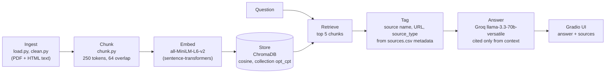

# Unofficial Guide

Answers F-1 student questions about CPT, OPT and STEM OPT from a small corpus of government rules, university international-office pages and one attorney article, and shows which sources each answer came from.
Official rules and practitioner commentary read differently: the first says what is required, the second says how it plays out. The corpus keeps them apart per chunk (`source_type`), so an answer can be traced back to a regulator or to commentary.

Built for CodePath AI201, 2026. Informational only, not legal or immigration advice.

## How it works



The corpus is 10 documents (9 official, 1 attorney) split into 362 chunks.
Each chunk keeps its source metadata through retrieval, and the source list under each answer is built from that metadata in code rather than by the model.

### Sample output

From the project's own evaluation run (`documents/eval_results.txt`):

> **Q:** What are the unemployment day limits on standard OPT versus STEM OPT?
> **A:** For standard OPT, you may be unemployed for up to 90 days, whereas for STEM OPT, you may be unemployed for an additional 60 days, for a total of 150 days.

The same report records a failure: a question about EIN requirements for freelancers got a refusal because retrieval missed the relevant text. See the evaluation report below.

## Run it locally

Requires Python 3 and a free Groq API key.

```bash
git clone https://github.com/Ned-Ibrahim/ai201-unofficial-guide.git
cd ai201-unofficial-guide
python -m venv .venv && source .venv/bin/activate
pip install -r requirements.txt
cp .env.example .env        # then set GROQ_API_KEY in .env
python src/load.py          # documents/raw -> documents/raw_text
python src/clean.py         # -> documents/clean
python src/chunk.py         # -> documents/chunks.jsonl (362 chunks)
python src/index.py         # embed and write ChromaDB to documents/chroma
python app.py               # Gradio UI at http://localhost:7860
python src/evaluate.py      # optional: re-run the 5 eval questions
```

Environment variables: `GROQ_API_KEY`.

## Tests

The repo has no automated tests, so there is no CI workflow. Quality was checked with the five-question evaluation below.

## License

MIT, see `LICENSE`.

---

## Domain

International students navigating CPT, OPT, STEM OPT, and related paperwork face dense official policy that doesn't explain real-world timing, common mistakes, or what peers did when their situation didn't match the FAQ. University ISS pages and government sites state the rules but leave gaps on filing workflow, processing times, and edge cases.

This system combines two layers:

1. **Official**, USCIS, DHS/SEVIS, ICE, NAFSA, and university ISS pages for policy and requirements.
2. **Unofficial**, immigration attorney commentary (and eventually student forums) for edge cases official pages omit.

Every answer must identify which layer each claim comes from. Unofficial sources inform practical orientation only; official sources take precedence when they conflict. This guide is informational, not legal or immigration advice.

---

## Document Sources

| # | Source | Type | URL or file path |
|---|--------|------|-----------------|
| 1 | USCIS, OPT for F-1 Students | Official (government) | `documents/clean/uscis_opt_f1.txt` | [uscis.gov](https://www.uscis.gov/working-in-the-united-states/students-and-exchange-visitors/optional-practical-training-opt-for-f-1-students) |
| 2 | USCIS, STEM OPT Extension | Official (government) | `documents/clean/uscis_stem_opt.txt` | [uscis.gov](https://www.uscis.gov/working-in-the-united-states/students-and-exchange-visitors/optional-practical-training-extension-for-stem-students-stem-opt) |
| 3 | DHS, International Students & Entrepreneurship | Official (government) | `documents/clean/dhs_entrepreneurship.txt` | [studyinthestates.dhs.gov](https://studyinthestates.dhs.gov/international-students-and-entrepreneurship) |
| 4 | NAFSA, 8 CFR 214.2(f) | Official (government) | `documents/clean/nafsa_8cfr.txt` | [nafsa.org](https://www.nafsa.org/regulatory-information/8cfr2142f) |
| 5 | Form I-765 Instructions (PDF) | Official (government) | `documents/clean/i-765instr.txt` | [uscis.gov](https://www.uscis.gov/sites/default/files/document/forms/i-765instr.pdf) |
| 6 | Form I-983 Instructions (PDF) | Official (government) | `documents/clean/i983_instructions.txt` | [ice.gov](https://www.ice.gov/doclib/sevis/pdf/i983Instructions.pdf) |
| 7 | ICE, OPT Directly Related to Major (PDF) | Official (government) | `documents/clean/opt_directly_related.txt` | [ice.gov](https://www.ice.gov/doclib/sevis/pdf/optDirectlyRelatedGuidance.pdf) |
| 8 | USC OIS, Post-Completion OPT | Official (university ISS) | `documents/clean/usc_postopt.txt` | [ois.usc.edu](https://ois.usc.edu/employment/employment-f1/opt/post-completion-opt/) |
| 9 | BU ISSO, 24-Month STEM OPT Employment Types | Official (university ISS) | `documents/clean/bu_stem_types.txt` | [bu.edu](https://www.bu.edu/isso/employment-internships/student-off-campus-work-and-training/24-month-stem-opt/employment-types/) |
| 10 | RJ Immigration Law, Self-Employment on OPT/STEM OPT | Unofficial (attorney) | `documents/clean/rj_selfemployed.txt` | [rjimmigrationlaw.com](https://rjimmigrationlaw.com/resources/can-i-be-self-employed-on-opt-or-stem-opt/) |

Metadata for all sources is in `documents/sources.csv`.

---

## Chunking Strategy

**Chunk size:** 250 tokens (~1,000 characters), leaves room for the tokenizer's 2 special tokens within MiniLM's 256-token limit.

**Overlap:** 64 tokens (~25% overlap).

**Why these choices fit your documents:**

The corpus mixes dense USCIS/8 CFR legal text, university advising FAQs, and law-firm articles. Rules are conditional, e.g. "X is allowed provided that A, B, and C." Splitting a rule from its conditions can return misleading partial context, which is especially harmful in immigration guidance. A recursive, structure-aware splitter breaks on headings → paragraphs → sentences → characters. Higher overlap (25% vs the usual 10-15%) carries trailing conditions across chunk boundaries. Each chunk carries full source metadata (`source_type`, `phase`, `source_url`, etc.) from `documents/sources.csv`.

**Preprocessing:** `src/load.py` extracts text from PDFs via `pdfplumber`; `src/clean.py` strips HTML, navigation boilerplate, and collapses excess whitespace into `documents/clean/`.

**Final chunk count:** 362 chunks across 10 documents (`documents/chunks.jsonl`).

---

## Embedding Model

**Model used:** `all-MiniLM-L6-v2` (sentence-transformers), run locally, with normalized embeddings stored in a ChromaDB cosine collection.

**Production tradeoff reflection:**

If cost were not a constraint, I would weigh: (1) **domain jargon**, CPT, OPT, STEM, I-765, and SEVIS abbreviations may embed poorly in a general-purpose model; a legal or immigration-fine-tuned embedder could improve retrieval on dense 8 CFR text; (2) **context length**, longer-context embedders (e.g. `e5-large`) could use larger chunks and reduce conditional-split risk; (3) **latency**, MiniLM is fast and runs locally; heavier models add seconds per query; (4) **multilingual support**, not critical for this English-only corpus, but would matter if student forum sources include non-English posts. For this project, MiniLM + small chunks + high overlap is the right cost/accuracy tradeoff.

---

## Grounded Generation

**System prompt grounding instruction (`src/query.py`, Groq `llama-3.3-70b-versatile`, temperature 0):**

The model is told to answer only from the numbered context passages, to use no outside knowledge, to cite passages inline by `[n]`, and to reply exactly `I don't have enough information on that.` when the context does not support an answer.

**How source attribution is surfaced in the response:**

Sources are attached in code from chunk metadata, not written by the model. Each answer is followed by the distinct source names and URLs of the retrieved chunks, and the list is suppressed when the model declines. Every chunk also carries `source_type` (`government`, `university`, `attorney`) from `documents/sources.csv`, so the Official or Unofficial layer is known per chunk. The current UI shows source names and URLs; it does not yet print the layer label next to each one.

---

## Evaluation Report

Run via `python src/evaluate.py` (full transcript in `documents/eval_results.txt`). k=5 retrieval, cosine distance.

| # | Question | Expected answer | System response (summary) | Retrieval | Accuracy |
|---|----------|-----------------|---------------------------|-----------|----------|
| 1 | What does USCIS require for post-completion OPT eligibility? | F-1 one academic year, major-related work, DSO SEVIS recommendation, I-765 in window, 12-mo cap | Listed all core requirements + 90/60 filing window (USC OIS, USCIS) | Relevant (0.19) | Accurate |
| 2 | What form is required for STEM OPT training, and who completes it? | Form I-983, student + employer, submitted to DSO | I-983, completed jointly by student and employer | Relevant (0.26) | Accurate |
| 3 | Unemployment day limits, standard OPT vs STEM OPT? | 90 days standard; 150 total with STEM | 90 standard, +60 → 150 total | Relevant (0.31) | Accurate |
| 4 | Can I be self-employed on OPT, and does it differ for STEM OPT? | Allowed on OPT w/ conditions; barred on STEM (needs employer + E-Verify + I-983) | Yes on OPT w/ conditions; not permitted on STEM OPT | Relevant (0.23) | Accurate |
| 5 | Do I need an EIN to file taxes as a freelancer on OPT? | No, optional for a sole proprietor; getting one doesn't violate status | Declined: "I don't have enough information on that." | Off-target (0.46-0.57) | **Inaccurate (failure)** |

A secondary limitation worth noting: Q4's correct answer was drawn entirely from the *unofficial* attorney source (RJ Immigration); the official USCIS/8 CFR self-employment language did not surface in the top-5, so a policy claim the domain would prefer to ground in official text is grounded in commentary.
---

## Spec Reflection

**One way the spec helped you during implementation:**

`planning.md` defined the source taxonomy (official vs unofficial), the metadata fields on every chunk, and the 256-token chunk ceiling tied to MiniLM, so ingestion and chunking (`src/load.py`, `src/clean.py`, `src/chunk.py`) could be built against a concrete contract instead of ad hoc splits.

**One way your implementation diverged from the spec, and why:**

The spec planned a nested folder layout (`documents/official/government/`, etc.) and 256-token chunks; the implementation uses a flat `documents/raw` → `raw_text` → `clean` pipeline with metadata in `sources.csv`, and `chunk_size=250` tokens to stay safely under the embedder's 256-token hard limit.

---

## AI Usage

**Instance 1**

- *What I gave the AI:* The Chunking Strategy and Documents table from `planning.md`, plus `requirements.txt`.
- *What it produced:* `src/load.py` (PDF/text ingestion), `src/clean.py` (HTML and nav stripping), and `src/chunk.py` (recursive splitter with `sources.csv` metadata).
- *What I changed or overrode:* Used a flat `documents/` layout with `sources.csv` instead of path-derived metadata; set chunk size to 250 tokens (not 256) to avoid embedder truncation.

**Instance 2**

- *What I gave the AI:* The full Domain, Source Taxonomy, and Evaluation Plan sections from `planning.md`.
- *What it produced:* The initial `planning.md` spec including architecture diagram, retrieval approach, and five eval questions with expected answers.
- *What I changed or overrode:* Trimmed the document list to the 10 sources actually collected so far; deferred student forum sources and UNL ISS pages to a later milestone.

---
